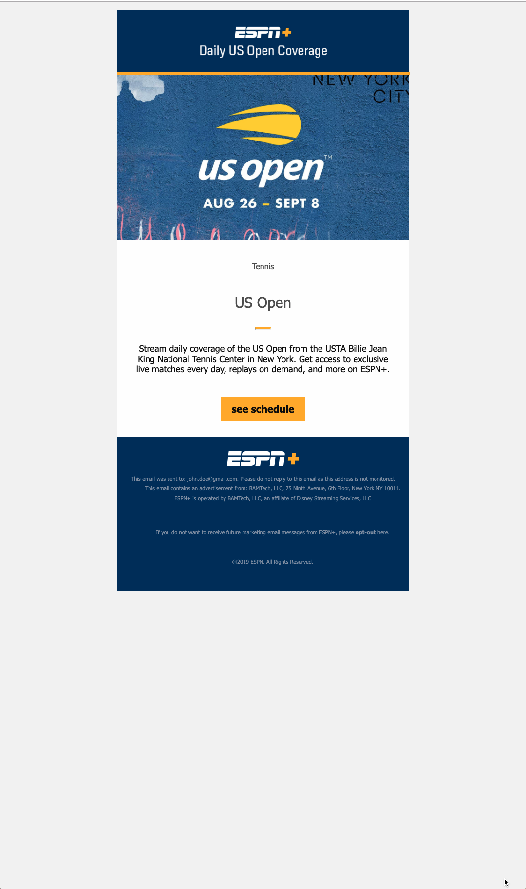

# upcoming-schedule-email

# Sept 12
- added another email  
- significant refactoring to make better use of handlebars

## Build Commands

Run `npm start` to kick off the build process. A new browser tab will open with a server pointing to your project files.

Run `npm run build` to inline your CSS into your HTML along with the rest of the build process.

Run `npm run litmus` to build as above, then submit to litmus for testing. *AWS S3 Account details required (config.json)*

Run `npm run mail` to build as above, then send to specified email address for testing. *SMTP server details required (config.json)*
